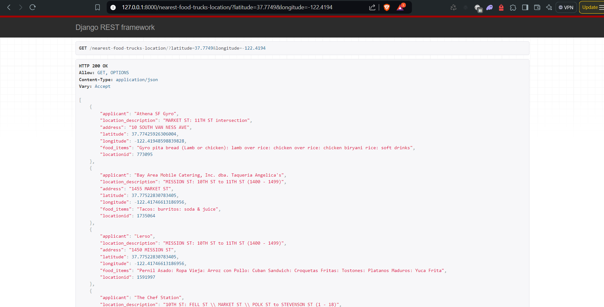

# Food Truck Finder - Django Application

This project is a Django-based application designed to help users find the nearest food trucks based on their current location in San Francisco. It uses a simple distance calculation algorithm to sort the food trucks by proximity to the user's input coordinates.


## Prerequisites
Before setting up the project, ensure you have the following software installed on your machine:
- Python 3.8+
- Django 5.1
- SQLite


## Setup Instructions

### 1. Clone the repository

First, you need to clone the repository to your local machine. You can do this using the following command:

```bash
git clone https://github.com/girishc24/Food-Trucks.git
cd Food-Trucks
```
### 2. Create a virtual environment

Create a virtual environment to install the project dependencies. This helps in maintaining project-specific dependencies and avoiding conflicts with other projects.

- For Linux/Mac:
```
python -m venv venv
source venv/bin/activate
```
- For Windows:
```
python -m venv venv
venv\Scripts\activate
```
### 3. Install dependencies

With the virtual environment activated, install the required dependencies using the requirements.txt file:
```
pip install -r requirements.txt
```
### 4. Database setup
Before running the application, set up the database by running the migrations:
```
python manage.py makemigrations
python manage.py migrate
```
### 5. Run the development server
Start the Django development server to test the application locally:
```
python manage.py runserver
```
Access the Application: Open your web browser and go to http://127.0.0.1:8000/.

Find Nearest Food Trucks: Use the following endpoint to find the nearest food trucks by providing latitude and longitude as query parameters:

```
GET /nearest-food-trucks-location/?latitude=<lat>&longitude=<lon>
```
Example :
```
http://127.0.0.1:8000/nearest-food-trucks-location/?latitude=37.7749&longitude=-122.4194
```
The API will return a JSON response with the five nearest food trucks.



### Explanation
Distance Calculation: The distance between the user's location and each food truck is calculated using the Haversine formula, which is suitable for calculating great-circle distances between two points on a sphere given their longitudes and latitudes.

Sorting: After calculating the distances, the food trucks are sorted by proximity to the user's input coordinates, and the top 5 closest trucks are returned.


### Code Structure

views.py: Contains the logic for handling the request and calculating the nearest food trucks.

models.py: Defines the FoodTruck model, which stores information about each food truck.

serializers.py: Serializes the FoodTruck objects for the API response.

